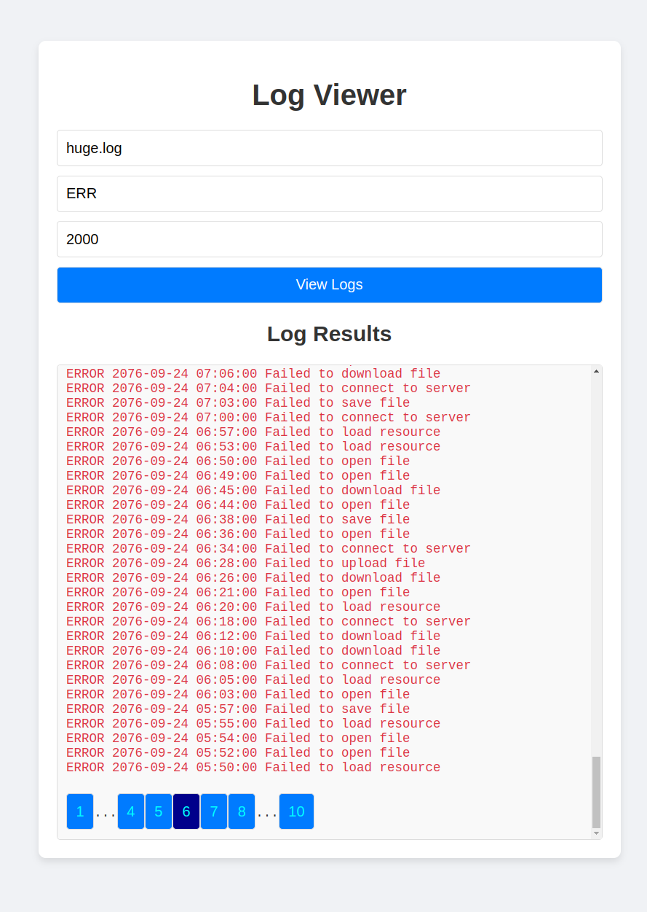

# Log Viewer Application

## V 1.1
Single server and front end client working with stream support and acceptable performance.

### Pre-requisite
- Have docker installed on the host.

- Commands tested on Ubuntu 24.04

### How to run:
1) Run the servers as containers:
```bash
cd Server
bash run.sh
```

2) Open the client application located at:
```
Client/index.html
```

3) Example input and output:



### Project Structure
```
Client
│
├── css
│   └── styles.css
│
├── js
│   └── scripts.js
│
└── index.html
Server
│
│
├── lib
│   ├── __init__.py
│   └── log_viewer.py
│
├── app_test.py
├── app.py
├── Dockerfile
├── log_generator.py
├── requirements.txt
└── run.sh
.dockerignore
.gitignore
README.md

```
