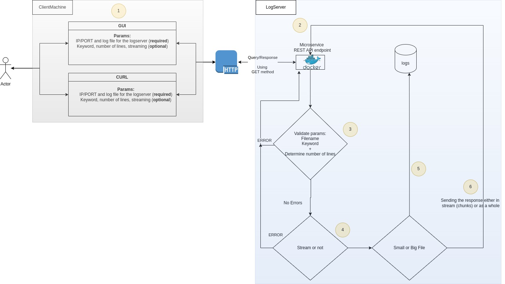
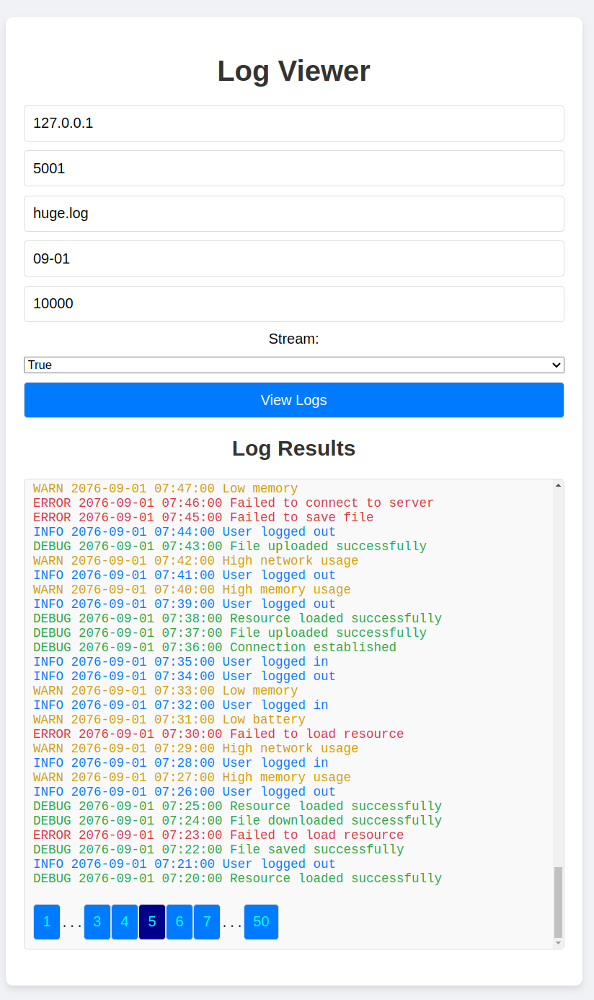

# Log Viewer Application
A REST API microservice for recieving and responding to a user request for gathering logs from servers and filter them.

## V 1.1
Multiple server(s) and GUI front-end client working with stream support and acceptable performance. This file presents overview, structure, pre-requisite, usage, test, etc. 

## High-level Design


### Work Flow:

1. User Interaction: The process begins with an actor (user) who can interact with the system through either a GUI or CURL. Both the GUI and CURL require the user to input the IP/PORT and log file for the log server (required). Optional parameters include a keyword, the number of lines, and streaming.
2. HTTP Request: The GUI or CURL sends an HTTP GET request to a microservice REST API endpoint, running in a Docker container.
3. Parameter Validation: The microservice validates the parameters, including the url path, filename, keyword, and the number of lines. If there are errors, the process terminates by sending back error to the user in a nice format (json) and human friendly (ie. nice error message).
4. Streaming Decision: If there are no errors, the microservice determines whether to stream the response or not based on the user request.
5. File Size Decision: The microservice then decides if the file is small or big. If file is small, load the whole file into memory for processing. If not, use chunk based reading (load chunk by chunk in memory).
6. Response Handling: Finally, the response is sent back to the user either in chunks (if streaming) or as a whole.

At any stage, in case of exceptional/unforseen errors the HTTP server will catch an error (by using try/catch) and send it back to the user as an error with a message attached.


## Project Structure
```
Docs
├── doc.pdf
├── code_reference
│   └── index.html
│
Client
│
├── css
│   └── styles.css
│
├── js
│   └── scripts.js
│
└── index.html
Server
│
│
├── lib
│   ├── __init__.py
│   └── log_viewer.py
|
├── app_test.py
├── app.py
├── Dockerfile
├── log_generator.py
├── requirements.txt
└── run.sh
.dockerignore
.gitignore
README.md

```

### Low-level documentation
For low-level (ie. code level) documentation please open the `Docs/code_reference/index.html` in a browser after cloning the repository. 

In the future version the automatic generation of documentation using Github actions and hosted online on Github pages will be added.

## How to run

### Pre-requisite
- Have docker installed on the host.

- Tested host: Ubuntu 24.04, Docker 27.4.1

- Have 4GB of size available for testing for the docker images/containers
```bash
docker system df
```

Output
```bash
TYPE            TOTAL     ACTIVE    SIZE      RECLAIMABLE
Images          1         1         3.487GB   0B (0%)
Containers      3         3         626.7kB   0B (0%)
```

### How to setup and execute from scratch
1) Build and start the log servers as containers:
```bash
cd Server 
bash run.sh #give this operation couple of minutes to create sample test file
```

After this operation, confirm you have 3 running containers:
```bash
docker ps -a
```

Output:
```bash
CONTAINER ID   IMAGE            COMMAND             CREATED      STATUS      PORTS                                         NAMES
7c7748af1750   python-log-api   "python app.py &"   9 days ago   Up 9 days   0.0.0.0:5003->5000/tcp, [::]:5003->5000/tcp   python-log-api-container-3
e9b86ed9266d   python-log-api   "python app.py &"   9 days ago   Up 9 days   0.0.0.0:5002->5000/tcp, [::]:5002->5000/tcp   python-log-api-container-2
b35046595ff1   python-log-api   "python app.py &"   9 days ago   Up 9 days   0.0.0.0:5001->5000/tcp, [::]:5001->5000/tcp   python-log-api-container-1
```

There should be already test logs created under /var/log in the containers. 
```bash
# login to container
docker exec -it python-log-api-container-1 bash
# see the sample test files
du -h /var/log/huge.log /var/log/medium.log /var/log/small.log /var/log/tiny.log
```

Output:
```bash
1.1G    /var/log/huge.log
87M     /var/log/medium.log
8.7M    /var/log/small.log
888K    /var/log/tiny.log
```

2) Open the client GUI application **from the host machine** to query log servers located at:
```
Client/index.html
```

3) Example request and response using GUI (from the host machine):




### Run e2e tests using PyTest

Login to one of the containers:

```bash
# login to container
docker exec -it python-log-api-container-1 bash
#Run the tests using:
pytest -v app_test.py
```

Sample output:
```bash
================================================ test session starts =================================================
platform linux -- Python 3.9.21, pytest-8.3.4, pluggy-1.5.0 -- /usr/local/bin/python3.9
cachedir: .pytest_cache
rootdir: /app
collected 15 items                                                                                                   

app_test.py::test_get_nonexistent_log PASSED                                                                   [  6%]
app_test.py::test_invalid_filename PASSED                                                                      [ 13%]
app_test.py::test_invalid_keyword PASSED                                                                       [ 20%]
app_test.py::test_invalid_number_of_lines PASSED                                                               [ 26%]
app_test.py::test_get_log PASSED                                                                               [ 33%]
app_test.py::test_get_log_stream PASSED                                                                        [ 40%]
app_test.py::test_keyword_search PASSED                                                                        [ 46%]
app_test.py::test_keyword_search_stream PASSED                                                                 [ 53%]
app_test.py::test_number_of_matches PASSED                                                                     [ 60%]
app_test.py::test_number_of_matches_stream PASSED                                                              [ 66%]
app_test.py::test_keyword_and_number_of_matches PASSED                                                         [ 73%]
app_test.py::test_keyword_and_number_of_matches_stream PASSED                                                  [ 80%]
app_test.py::test_read_large_file PASSED                                                                       [ 86%]
app_test.py::test_read_large_file_stream PASSED                                                                [ 93%]
app_test.py::test_read_large_file_stream_append PASSED                                                         [100%]

================================================= 15 passed in 0.47s =================================================
```